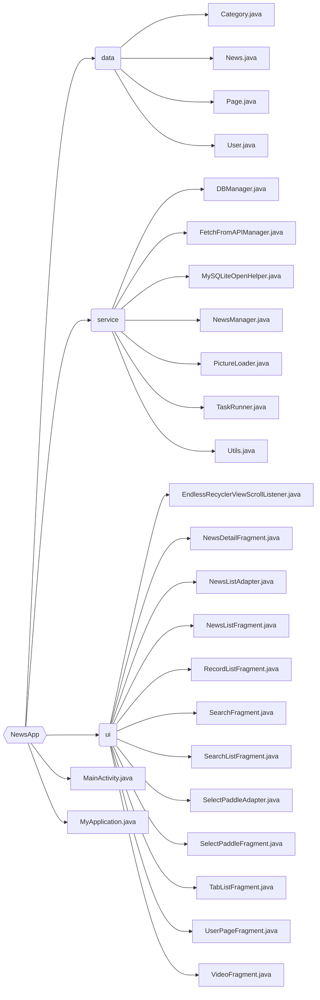

# NewsApp

清华大学计算机系暑期课程《程序设计训练(Java)》大作业报告。

**目录**
- [NewsApp(头条大师)](#newsapp)
  - [作业描述](#作业描述)
  - [代码结构](#代码结构)
  - [具体实现](#具体实现)
  - [遇到的问题及其解决方法](#遇到的问题及其解决方法)
  - [总结和心得](#总结和心得)

## 作业描述

互联网科技的发展让新闻的传播从报纸、广播、电视等方式发展到了网页以及最近几年兴起的手机 app 客户端，人们获取新闻的方式变得异常容易。手机上的新闻 app 让大家随时随地掏出手机即可看天下事，手机新闻 app 不再是一个简简单单的新闻获取工具，许多 app 已经利用数据挖掘构建出了新闻推荐引擎，为用户提供个性化、更有价值的新闻，例如 [今日头条](https://www.toutiao.com/)、[天天快报](http://www.ttkbao.com/) 等。

现在让我们也来尝试一下做一个新闻 app！本次大作业的任务就是实现一款浏览新闻的工具类软件。其中，抓取新闻由 [清华大学计算机系知识工程实验室](https://keg.cs.tsinghua.edu.cn/) 进行，并提供了访问新闻的接口，同学们根据网络接口文档和作业要求利用课上所学的 Java 和 Android 开发知识实现一个新闻客户端即可。

## 代码结构

代码结构如下图所示。

- `data`
  - `Category.java` 是一个枚举类，包含可被搜索的八个分类。
  - `News.java` 是一个类，用于描述一篇新闻，包含 `title`，`content` 等属性。
  - `Page.java` 是一个枚举类，包含当前页面可能处于的状态（如“新闻详情界面”“新闻列表界面”“搜索界面”等）。
  - `User.java` 是一个类，用于描述用户个性化信息（如选择的分类）的读写。
- `service`
  - `DBManager.java` 用于数据库管理。
  - `FetchFromAPIManager.java` 用于新闻详情获取。
  - `MySQLiteOpenHelper.java` 用于数据库管理。
  - `NewsManager.java` 用于新闻相关处理，包含已浏览新闻列表的读写。
  - `PictureLoader.java` 用于展示图片。
  - `TaskRunner.java` 用于管理进程。
  - `Utils.java` 是一个类，包含了很多辅助的函数，如将一个枚举数组转化为字符串等。
- `ui`
  - `EndlessRecyclerViewScrollListener.java` 是展示新闻列表所需要的 Listener。
  - `NewsDetailFragment.java` 是展示新闻详情的 Fragment。
  - `NewsListAdapter.java` 是辅助展示新闻列表的 Adapter。
  - `NewsListFragment.java` 是展示推荐界面新闻列表的 Fragment。
  - `RecordListFragment.java` 是展示浏览记录、收藏夹新闻列表的 Fragment。
  - `SearchFragment.java` 是搜索界面的 Fragment。
  - `SearchListFragment.java` 是展示搜索结果新闻列表的 Fragment。
  - `SelectPaddleAdapter.java` 是辅助修改分类界面的 Adapter。
  - `SelectPaddleFragment.java` 是修改分类界面的 Fragment。
  - `TabListFragment.java` 是推荐界面上方分类栏的 Fragment。
  - `UserPageFragment.java` 是用户主页的 Fragment。
  - `VideoFragment.java` 是播放视频的 Fragment。
- `MainActivity.java`
- `MyApplication.java`

## 具体实现

### 新闻详情获取

### 查找界面的时间选择器

### 浏览记录以及收藏的本地存储

## 遇到的问题及其解决方法

### JDK 安装包重复导入的问题

### 对手机“返回键”行为的处理

### 修改列表分类时的抖动特效

### 查找记录时的时间范围设置

### 视频播放问题

### 应用切换到后台时当前界面及数据如何保留

### 浏览记录和收藏夹中新闻列表的展示顺序

## 总结和心得

