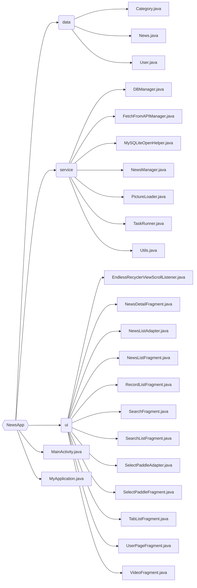

# NewsApp

清华大学计算机系暑期课程《程序设计训练》大作业，完成者熊泽恩，学号 2022011223。

**目录**
- [NewsApp](#newsapp)
  - [作业描述](#作业描述)
  - [代码结构](#代码结构)
  - [具体实现](#具体实现)
  - [总结和心得](#总结和心得)
    - [遇到的问题及其解决方法](#遇到的问题及其解决方法)
    - [心得体会](#心得体会)

## 作业描述

互联网科技的发展让新闻的传播从报纸、广播、电视等方式发展到了网页以及最近几年兴起的手机 app 客户端，人们获取新闻的方式变得异常容易。手机上的新闻 app 让大家随时随地掏出手机即可看天下事，手机新闻 app 不再是一个简简单单的新闻获取工具，许多 app 已经利用数据挖掘构建出了新闻推荐引擎，为用户提供个性化、更有价值的新闻，例如 [今日头条](https://www.toutiao.com/)、[天天快报](http://www.ttkbao.com/) 等。

现在让我们也来尝试一下做一个新闻 app！本次大作业的任务就是实现一款浏览新闻的工具类软件。其中，抓取新闻由 [清华大学计算机系知识工程实验室](https://keg.cs.tsinghua.edu.cn/) 进行，并提供了访问新闻的接口，同学们根据网络接口文档和作业要求利用课上所学的 Java 和 Android 开发知识实现一个新闻客户端即可。

## 代码结构

## 具体实现

## 总结和心得

### 遇到的问题及其解决方法

#### 方

#### 

### 心得体会

